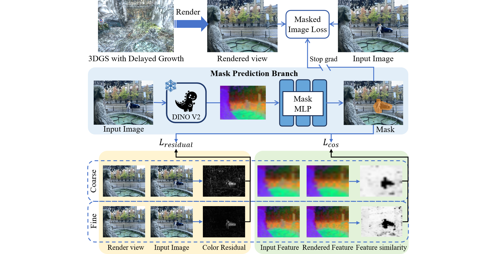

<h1 align="center">RobustSplat: Decoupling Densification and Dynamics for Transient-Free 3DGS</h1>

<div align="center">

[](https://fcyycf.github.io/RobustSplat/)
[](https://arxiv.org/abs/2506.02751)
[](https://huggingface.co/datasets/fcy99/RobustSplat-data)
[](https://huggingface.co/fcy99/RobustSplat-checkpoints)

</div>



<!-- ## Abstract
*3D Gaussian Splatting (3DGS) has gained significant attention for its real-time, photo-realistic rendering in novel view synthesis and 3D modeling. However, existing methods struggle with accurately modeling scenes affected by transient objects, leading to artifacts in the rendered images. We identify that the Gaussian densification process, while enhancing scene detail capture, unintentionally contributes to these artifacts by growing additional Gaussians that model transient disturbances. To address this, we propose RobustSplat, a robust solution based on two critical designs. First, we introduce a delayed Gaussian growth strategy that prioritizes optimizing static scene structure before allowing Gaussian splitting/cloning, mitigating overfitting to transient objects in early optimization. Second, we design a scale-cascaded mask bootstrapping approach that first leverages lower-resolution feature similarity supervision for reliable initial transient mask estimation, taking advantage of its stronger semantic consistency and robustness to noise, and then progresses to high-resolution supervision to achieve more precise mask prediction. Extensive experiments on multiple challenging datasets show that our method outperforms existing methods, clearly demonstrating the robustness and effectiveness of our method.* -->

## Cloning the Repository
```bash
git clone https://github.com/fcyycf/RobustSplat.git --recursive
```
## Installation
Follow the instructions in the [Gaussian Splatting](https://github.com/graphdeco-inria/gaussian-splatting) to setup the environment. You can simply run the following command:
```bash
conda env create --file environment.yml
```

## Datasets
We use the following datasets in our experiments：

[NeRF On-the-go dataset](https://rwn17.github.io/nerf-on-the-go/)

[RobustNeRF dataset](https://robustnerf.github.io/)

> **Note:** Since NeRF *On-the-go* does not include SfM data and RobustNeRF provides OpenCV-formatted camera parameters, we re-ran SfM for 3DGS-codebase requirments.

> Our pre-processed datasets are available at https://huggingface.co/datasets/fcy99/RobustSplat-data.

## Preparing Datasets

### Preprocessing

Follow the usage in the [SpotLessSplats](https://github.com/lilygoli/SpotLessSplats) to preprocess the dataset formats:
```bash
python ./prepare/prep_data.py --dataset <dataset path>
```


### Structure from Motion

You should passing the sparse reconstruction and undistortion using COLMAP:
```bash
# Install the COLMAP if not already on your system
conda install conda-forge::colmap
```
```bash
# Run COLMAP
bash ./prepare/colmap.sh <dataset path> 
```


### Downsample

We using factor **8** for downsample (factor **4** for *patio* and *arcdetriomphe* of NeRF *On-the-go*):
```bash
python ./prepare/downsample.py --dataset <dataset path> --factor <factor>
```

> **Note:** The folder *imges_{factor}* and *imges_{4\*factor}* will be genertated in dataset path.

## Running

Run the following commands for training, rendering, and evaluation:
```bash
# Training
python train.py -s <dataset path> -m <model path> -r <factor>
```
```bash
# Rendering
python render.py -m <model path>
```
```bash
# Evaluation
python metrics.py -m <model path>
```

## TODO List
- [x] Release our prepared datasets.
- [x] Release our checkpoints.


## Citation
If you find this work useful, please consider citing:
```bibtex
@inproceedings{2025RobustSplat,
    author    = {Fu, Chuanyu and Zhang, Yuqi and Yao, Kunbin and Chen, Guanying and Xiong, Yuan and Huang, Chuan and Cui, Shuguang and Cao, Xiaochun},
    title     = {RobustSplat: Decoupling Densification and Dynamics for Transient-Free 3DGS},
    booktitle = {ICCV},
    year      = {2025}
}
```

## Acknowledgements
This repo benefits from [Gaussian Splatting](https://github.com/graphdeco-inria/gaussian-splatting), [DINOv2](https://github.com/facebookresearch/dinov2), [SpotLessSplats](https://github.com/lilygoli/SpotLessSplats), and [WildGaussians](https://github.com/jkulhanek/wild-gaussians). Thanks for these excellent contributions.